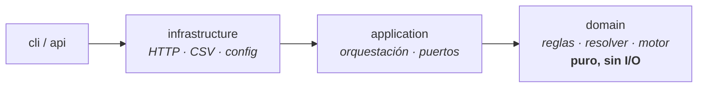

# Xpendit — Motor de Reglas de Gastos

[](https://github.com/RaimundoDiaz/xpendit-expense-engine/actions/workflows/ci.yml)


> Valida gastos contra una política configurable (`APROBADO` · `PENDIENTE` · `RECHAZADO`),
> convierte monedas con tasas históricas reales (Open Exchange Rates) y analiza lotes de
> gastos detectando anomalías.

Construido en 3 partes que se apoyan una sobre otra: (1) motor de reglas puro,
(2) cliente de tasas de cambio inyectable, (3) analizador de lotes sobre un CSV.

📖 **Documentación navegable:** [Wiki del proyecto](https://github.com/RaimundoDiaz/xpendit-expense-engine/wiki)

## Arquitectura

Clean Architecture / Hexagonal — el dominio es puro y no conoce la infraestructura. Las
dependencias apuntan **hacia adentro**:



- **domain/**: modelos, reglas (patrón Strategy), resolvedor de prioridades y el motor. Sin red ni archivos.
- **application/**: orquestación y puertos (interfaces) que la infraestructura implementa.
- **infrastructure/**: adaptadores — cliente HTTP de tasas, lector CSV, configuración.
- **cli/**: punto de entrada del analizador de lotes.

> Diseño extensible: agregar una regla nueva = crear una clase en `domain/rules/` y registrarla
> en `registry.py`. El motor y el resolvedor no se tocan (principio Open/Closed).

## Requisitos

- Python 3.12+

## Inicio rápido

**Un solo comando** — crea el venv, instala todo, configura `.env.local` y verifica con tests + pyright:

```bash
bash setup.sh
```

**Con Claude Code** *(extra, iniciativa propia)* — clona el repo, abre Claude Code en la carpeta
y pega este prompt; la skill `preparar-proyecto` deja todo instalado y verificado:

```text
Prepara este proyecto y déjalo listo para correr: instala dependencias, configura el
entorno y verifica con los tests. Usa la skill preparar-proyecto.
```

(También puedes invocarla directamente con `/preparar-proyecto`.)

## Instalación manual

```bash
python3.12 -m venv .venv
source .venv/bin/activate
pip install -r requirements-dev.txt   # runtime + herramientas de desarrollo (tests, pyright)
pip install -e .                      # instala el paquete (habilita `python -m expense_engine...`)
```

(Para solo ejecutar, sin dev tools: `pip install -r requirements.txt && pip install -e .`.)

## Configuración (API Key)

El cliente de tasas usa [Open Exchange Rates](https://openexchangerates.org) (plan gratuito).

1. Crea una cuenta y copia tu **App ID**.
2. Copia `.env.example` a `.env.local` y completa el valor:

```bash
cp .env.example .env.local
# edita .env.local:  open_exchange_app_id=TU_APP_ID
```

`.env.local` está en `.gitignore` — la clave nunca se commitea.

## Uso

Activa el entorno (`source .venv/bin/activate`) y luego:

```bash
pytest                 # correr las pruebas unitarias
pyright                # type-check estricto
python -m expense_engine.cli.analyze "Desafío técnico — Xpendit/gastos_historicos.csv"
```

El analizador imprime el desglose por estado y las anomalías. Con `--json` devuelve el
resultado por gasto.

### Ejemplo de salida (`--json`)

Cada gasto se resuelve al contrato `{gasto_id, status, alertas}`:

```json
[
  { "gasto_id": "g_001", "status": "APROBADO", "alertas": [] },
  {
    "gasto_id": "g_007",
    "status": "RECHAZADO",
    "alertas": [
      { "codigo": "LIMITE_CATEGORIA", "mensaje": "Gasto de 'food' excede el límite permitido." }
    ]
  }
]
```

## Estructura

```
src/expense_engine/   código fuente (domain / application / infrastructure / cli / api *)
tests/                pruebas unitarias (espejo de src/)
docs/                 documentación de diseño
.claude/              skills y agentes de Claude Code *
setup.sh              instalación en un comando *
ANALISIS.md           hallazgos del análisis de lotes (Parte 3)

* extra por iniciativa propia — ver docs/08-extras-iniciativa.md
```

## Extras (iniciativa propia)

Además del alcance del desafío (Partes 1–3) agregamos, **por iniciativa propia**, trabajo
pensado para la evolución en vivo del código:

- **Código:** scaffold de reglas, provider de tasas con fallback, lectura streaming del CSV,
  scaffold de API HTTP (`api/`, deps opcionales), `setup.sh` de instalación y **CI** (GitHub
  Actions: `pytest` + `pyright` en cada push).
- **Tooling de IA** (el evaluador fomenta el uso de IA, así que lo versionamos en `.claude/`):
  - *Skills* — `nueva-regla`, `nuevo-provider`, `nueva-anomalia`, `exponer-api`, `preparar-proyecto`.
  - *Agentes* — `revisor-de-reglas`, `guardian-arquitectura`, `qa-y-pruebas`.
- **Documentación:** análisis de escala y una wiki navegable.

Todo está catalogado en [`docs/08-extras-iniciativa.md`](docs/08-extras-iniciativa.md), con el
análisis de escala en [`docs/07-escalabilidad.md`](docs/07-escalabilidad.md). Si ven archivos
"de más", no es un error: es trabajo deliberado y documentado.
